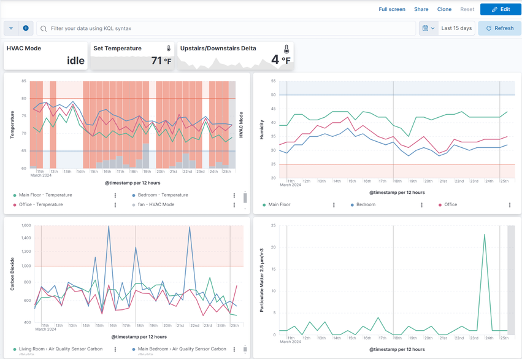
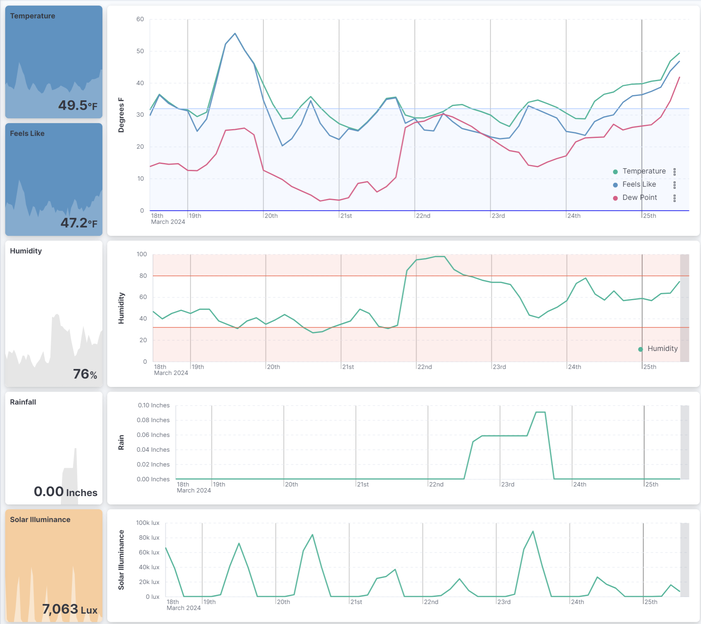
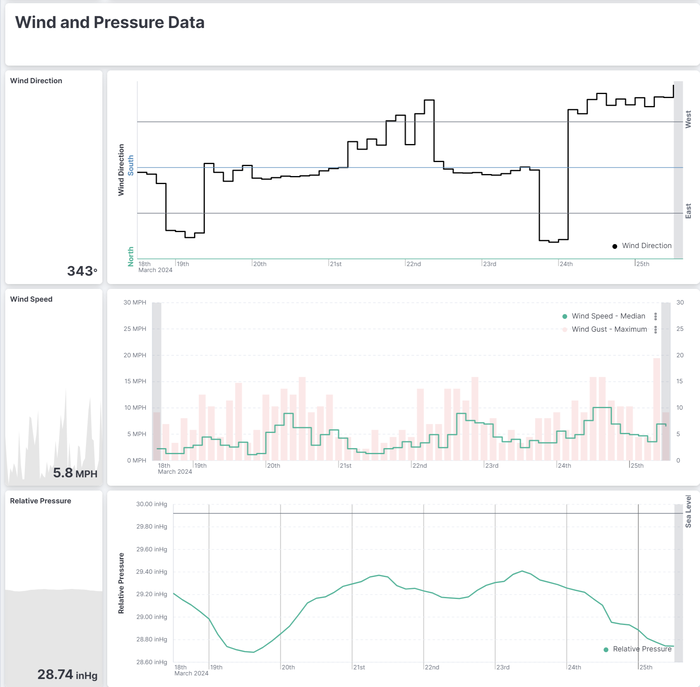
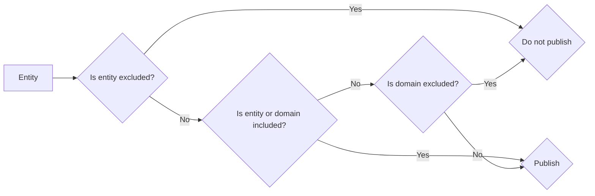
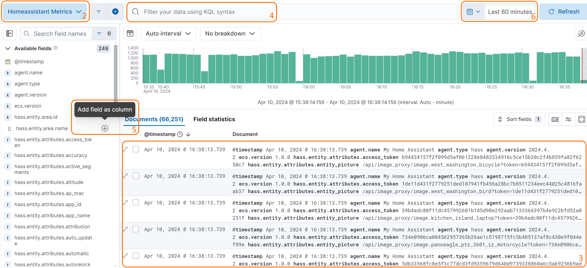
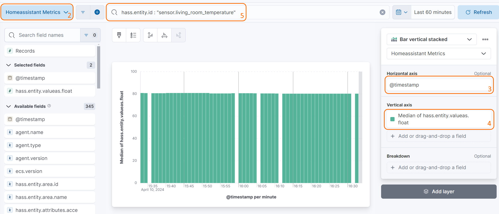

Elasticsearch Component for Home-Assistant

[](https://github.com/hacs/integration)
=====

Publish Home Assistant events to your [Elasticsearch](https://elastic.co) cluster!

## Table of Contents

- [Features](#features)
- [Inspiration](#inspiration)
  - [HVAC Usage](#hvac-usage)
  - [Weather Station](#weather-station)
  - [Additional examples](#additional-examples)
- [Compatibility](#compatibility)
- [Getting Started](#getting-started)
- [Installation](#installation)
- [Create Elasticsearch Credentials](#create-elasticsearch-credentials)
  - [Authenticating via API Key](#authenticating-via-api-key)
  - [Authenticating via username/password](#authenticating-via-usernamepassword)
- [Setup](#setup)
- [Configuration options](#configuration-options)
  - [Entity selection](#entity-selection)
  - [Publish mode](#publish-mode)
- [Using Home Assistant data in Kibana](#using-homeassistant-data-in-kibana)
- [Defining your own Index Mappings, Settings, and Ingest Pipeline](#defining-your-own-index-mappings-settings-and-ingest-pipeline)
- [Create your own cluster health sensor](#create-your-own-cluster-health-sensor)
- [Support](#support)
- [Contributing](#contributing)

## Features

- Efficiently publishes Home-Assistant events to Elasticsearch using the Bulk API
- Automatically sets up Datastreams using Time Series Data Streams ("TSDS"), Datastream Lifecycle Management ("DLM"), or Index Lifecycle Management ("ILM") depending on your cluster's capabilities
- Supports Elastic's [stack security features](https://www.elastic.co/elastic-stack/security) via optional username, password, and API keys
- Selectively publish events based on domains or entities

## Inspiration

### HVAC Usage
Graph your home's climate and HVAC Usage:



### Weather Station
Visualize and alert on data from your weather station:





### Additional examples

Some usage examples inspired by [real users](https://github.com/legrego/homeassistant-elasticsearch/issues/203):

- Utilizing a Raspberry Pi in [kiosk mode](https://www.raspberrypi.com/tutorials/how-to-use-a-raspberry-pi-in-kiosk-mode/) with a 15" display, the homeassistant-elasticsearch integration enables the creation of rotating fullscreen [Elasticsearch Canvas](https://www.elastic.co/kibana/canvas). Those canvas displays metrics collected from various Home Assistant integrations, offering visually dynamic and informative dashboards for monitoring smart home data.
- To address temperature maintenance issues in refrigerators and freezers, temperature sensors in each appliance report data to Home Assistant, which is then published to Elasticsearch. Kibana's [alerting framework](https://www.elastic.co/kibana/alerting) is employed to set up rules that notify the user if temperatures deviate unfavorably for an extended period. The Elastic rule engine and aggregations simplify the monitoring process for this specific use case.
- Monitoring the humidity and temperature in a snake enclosure/habitat for a user's daughter, the integration facilitates the use of Elastic's Alerting framework. This choice is motivated by the framework's suitability for the monitoring requirements, providing a more intuitive solution compared to Home Assistant automations.
- The integration allows users to maintain a smaller subset of data, focusing on individual stats of interest, for an extended period. This capability contrasts with the limited retention achievable with Home Assistant and databases like MariaDB/MySQL. This extended data retention facilitates very long-term trend analysis, such as for weather data, enabling users to glean insights over an extended timeframe.

## Compatibility

- Elasticsearch 8.0+, 7.11+ (Self or [Cloud](https://www.elastic.co/cloud) hosted). [Version `0.4.0`](https://github.com/legrego/homeassistant-elasticsearch/releases/tag/v0.4.0) includes support for older versions of Elasticsearch.
- [Elastic Common Schema version 1.0.0](https://github.com/elastic/ecs/releases/tag/v1.0.0)
- [Home Assistant Community Store](https://github.com/custom-components/hacs)
- Home Assistant 2024.1

The following table covers the Elasticsearch functionality used by the integration when configured against various versions of Elasticsearch:

| Elasticsearch Version | Datastreams | Time Series Datastreams | Datastream Lifecycle Management | Index Lifecycle Management |
|-----------------------|-------------|-------------------------|---------------------------------|----------------------------|
| 7.11.0 - 7.12.0       | Supported   |                         |                                 | Partially Supported [See Note]      |
| 7.13.0 - 7.17.0       | Supported   |                         |                                 | Supported                  |
| 8.0.0 - 8.6.0         | Supported   |                         |                                 | Supported                  |
| 8.7.0 - 8.10.0        |             | Supported               |                                 | Supported                  |
| 8.11.0+               |             | Supported               | Supported                       |                            |

Note: Index Lifecycle Management is partially supported in versions 7.11.0 - 7.12.0. The integration will create an ILM policy that performs time-based rollover but does not support shard-size-based rollover.

## Getting Started

The Elasticsearch component requires, well, [Elasticsearch](https://www.elastic.co/products/elasticsearch)!
This component will not host or configure Elasticsearch for you, but there are many ways to run your own cluster.
Elasticsearch is open source and free to use: just bring your own hardware!
Elastic has a [great setup guide](https://www.elastic.co/start) if you need help getting your first cluster up and running.

If you don't want to maintain your own cluster, then give the [Elastic Cloud](https://www.elastic.co/cloud) a try! There is a free trial available to get you started.

## Installation

This component is available via the Home Assistant Community Store (HACS) in their default repository. Visit https://hacs.xyz/ for more information on HACS.

Alternatively, you can manually install this component by copying the contents of `custom_components` to your `$HASS_CONFIG/custom_components` directory, where `$HASS_CONFIG` is the location on your machine where Home-Assistant lives.
Example: `/home/pi/.homeassistant` and `/home/pi/.homeassistant/custom_components`. You may have to create the `custom_components` directory yourself.

## Create Elasticsearch Credentials

The integration supports authenticating via API Key, Username and Password or unauthenticated access.

### Authenticating via API Key

You must first create an API Key with the appropriate privileges.
Note that if you adjust the `index_format` or `alias` settings that the role definition must be updated accordingly:

```json
POST /_security/api_key
{
  "name": "home_assistant_component",
  "role_descriptors": {
    "hass_writer": {
      "cluster": [
        "manage_index_templates",
        "manage_ilm",
        "monitor"
      ],
      "indices": [
        {
          "names": [
            "metrics-homeassistant*"
          ],
          "privileges": [
            "manage",
            "index",
            "create_index",
            "create"
          ]
        }
      ]
    }
  }
}
```

The API key response looks like this:

```json
{
  "id": "895G5o4BPC086HrYG5VS",
  "name": "home_assistant_component",
  "api_key": "nwac3lCdSfSovgWOUTJ9YA",
  "encoded": "ODk1RzVvNEJQQzABAkhyyUc3VlM6bndYYjdsQ2RTZlNvdmdXT1VUSjlZQQ=="
}
```

We need to use the `encoded`.


### Authenticating via username/password

If you choose not to authenticate via an API Key, you need to create a user and role with appropriate privileges.

```json
# Create role
POST /_security/role/hass_writer
{
  "cluster": [
    "manage_index_templates",
    "manage_ilm",
    "monitor"
  ],
  "indices": [
    {
      "names": [
        "metrics-homeassistant*"
      ],
      "privileges": [
        "manage",
        "index",
        "create_index",
        "create"
      ]
    }
  ]
}
```

```json
# Create user
POST /_security/user/hass_writer
{
  "full_name": "Home Assistant Writer",
  "password": "changeme",
  "roles": ["hass_writer"]
}
```

## Setup

This component is configured interactively via Home Assistant's integration configuration page.

1. Restart Home-assistant once you've completed the installation instructions above.
2. From the `Integrations` configuration menu, add a new `Elasticsearch` integration. 
3. Select the appropriate authentication method
4. Provide connection information and optionally credentials to begin setup. 
5. Once the integration is setup, you may tweak all settings via the "Options" button on the integrations page.
   

## Configuration options

### Entity selection
You can choose to include/exclude entities based on their domain or entity id. This allows you to publish only the entities you are interested in to Elasticsearch.
By default, all entities and domains are included.
You can combine inclusion and exclusion filters to fine-tune the entities you want to publish. The following flowchart describes the logic used to determine if an entity is published:



### Publish mode
There are three modes to publish data to Elasticsearch:
- `All` - Publish configured entities to Elasticsearch, including those which did not undergo a state or attribute change.
- `State changes` - Publish configured entities to Elasticsearch only when their state changes.
- `Any changes` - Publish configured entities to Elasticsearch when their state or attributes change.

| Publish Mode | State Change | Attribute Change | No Change |
| ---- | ---- | ---- | ---- |
| All | ✅  Publishes | ✅ Publishes | ✅ Publishes |
| Any Changes | ✅  Publishes | ✅  Publishes | 🚫 Does not publish |
| State Changes | ✅  Publishes | 🚫 Does not publish | 🚫 Does not publish |


## Using Homeassistant data in Kibana

The integration will put data into Elasticsearch under `metrics-homeassistant.*`. To explore your data, create visualizations, or dashboards in Kibana you first need to create a Data View. To create a Data View follow the instructions in the Kibana documentation here: [Create a data view called Homeassistant Metrics](https://www.elastic.co/guide/en/kibana/current/data-views.html#create-data-view). For the Index pattern, use: `metrics-homeassistant.*`

### Exploring Homeassistant data in Kibana

Once you have created a Data View, you can start exploring your Home Assistant data in Kibana using `Discover`:
1. In Kibana select `Discover`
2. Select the `Homeassistant Metrics` Data View at the top left
3. You can now see all the Home Assistant data that has been published to Elasticsearch
4. You can filter the data using the filter bar at the top
5. You can pull specific fields into the document table at the bottom by clicking on the `+` icon next to a field
6. You can change the time range of the data you are viewing using the time picker in the top right



### Viewing Home Assistant data in Kibana

When creating new visualizations you may find the following fields useful:

1. `@timestamp` - The timestamp of the event (ex. `Apr 10, 2024 @ 16:23:25.878`)
1. `hass.entity.attributes.friendly_name` - The name of the entity in Home Assistant (ex. `Living Room EcoBee Temperature`)
1. `hass.entity.device.area.name` - The area of the device in Home Assistant (ex. `Living Room`)
1. `hass.entity.id` - The entity id of the entity in Home Assistant (ex. `sensor.living_room_ecobee_temperature`)
1. `hass.entity.value` - The state of the entity in Home Assistant (ex. `72.5`), as a string-typed value
1. `hass.entity.valueas.integer` - The state of the entity in Home Assistant (ex. `72`), as an integer-typed value
1. `hass.entity.valueas.float` - The state of the entity in Home Assistant (ex. `72.5`), as a float-typed value
1. `hass.entity.valueas.boolean` - The state of the entity in Home Assistant (ex. `true`), as a boolean-typed value
1. `hass.entity.valueas.date` - The state of the entity in Home Assistant (ex. `2024-04-10`), as a date-typed value
1. `hass.entity.valueas.datetime` - The state of the entity in Home Assistant (ex. `2024-04-10T16:23:25.878`), as a datetime-typed value
1. `hass.entity.valueas.time` - The state of the entity in Home Assistant (ex. `16:23:25.878`), as a time-typed value

To build a visualization that shows the temperature of a specific entity over time, you can use the following steps:
1. In Kibana select `Visualizations` and create a new Lens visualization
2. Select `Homeassistant Metrics`
3. For the `Horizontal axis` select `@timestamp`
4. For the `Vertical axis` select `hass.entity.valueas.float`
5. In the filter bar at the top, add a filter for `hass.entity.id` and set the value to the entity id of the entity you want to visualize (ex. `sensor.living_room_ecobee_temperature`) or `hass.entity.attributes.friendly_name` and set the value to the friendly name of the entity you want to visualize (ex. `Living Room EcoBee Temperature`)



## Defining your own Index Mappings, Settings, and Ingest Pipeline

You can customize the mappings, settings and define an [ingest pipeline](https://www.elastic.co/guide/en/elasticsearch/reference/current/ingest.html) by creating a [component template](https://www.elastic.co/guide/en/elasticsearch/reference/current/indices-component-template.html) called `metrics-homeassistant@custom`


The following is an example on how to push your Home Assistant metrics into an ingest pipeline called `metrics-homeassistant-pipeline`:

```
PUT _ingest/pipeline/metrics-homeassistant-pipeline
{
  "description": "Pipeline for HomeAssistant dataset",
  "processors": [ ]
}
```

```
PUT _component_template/metrics-homeassistant@custom
{
  "template": {
    "mappings": {}
    "settings": {
      "index.default_pipeline": "metrics-homeassistant-pipeline",
    }
  }
}
```

Component template changes apply when the datastream performs a rollover so the first time you modify the template you may need to manually initiate ILM rollover to start applying the pipeline.

## Create your own cluster health sensor
Versions prior to `0.6.0` included a cluster health sensor. This has been removed in favor of a more generic approach. You can create your own cluster health sensor by using Home Assistant's built-in [REST sensor](https://www.home-assistant.io/integrations/sensor.rest).

```yaml
# Example configuration
sensor:
  - platform: rest
    name: "Cluster Health"
    unique_id: "cluster_health" # Replace with your own unique id. See https://www.home-assistant.io/integrations/sensor.rest#unique_id
    resource: "https://example.com/_cluster/health" # Replace with your Elasticsearch URL
    username: hass # Replace with your username
    password: changeme # Replace with your password
    value_template: "{{ value_json.status }}"
    json_attributes: # Optional attributes you may want to include from the /_cluster/health API response
      - "cluster_name"
      - "status"
      - "timed_out"
      - "number_of_nodes"
      - "number_of_data_nodes"
      - "active_primary_shards"
      - "active_shards"
      - "relocating_shards"
      - "initializing_shards"
      - "unassigned_shards"
      - "delayed_unassigned_shards"
      - "number_of_pending_tasks"
      - "number_of_in_flight_fetch"
      - "task_max_waiting_in_queue_millis"
      - "active_shards_percent_as_number"
```

## Support

This project is not endorsed or supported by either Elastic or Home-Assistant - please open a GitHub issue for any questions, bugs, or feature requests.

## Contributing

Contributions are welcome! Please see the [Contributing Guide](CONTRIBUTING.md) for more information.
