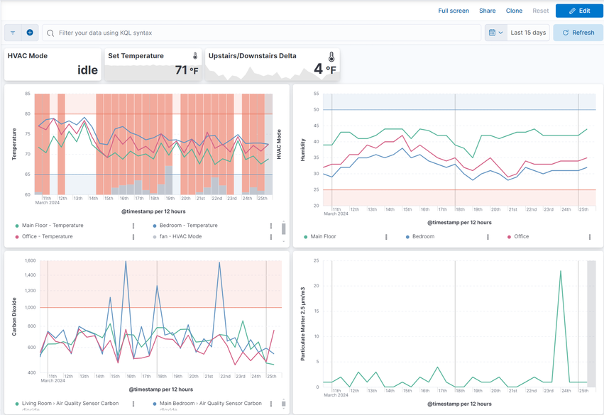
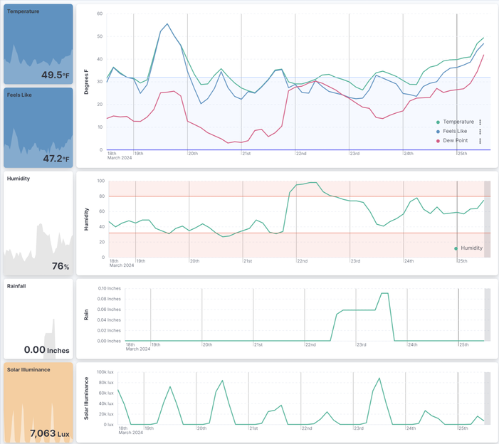
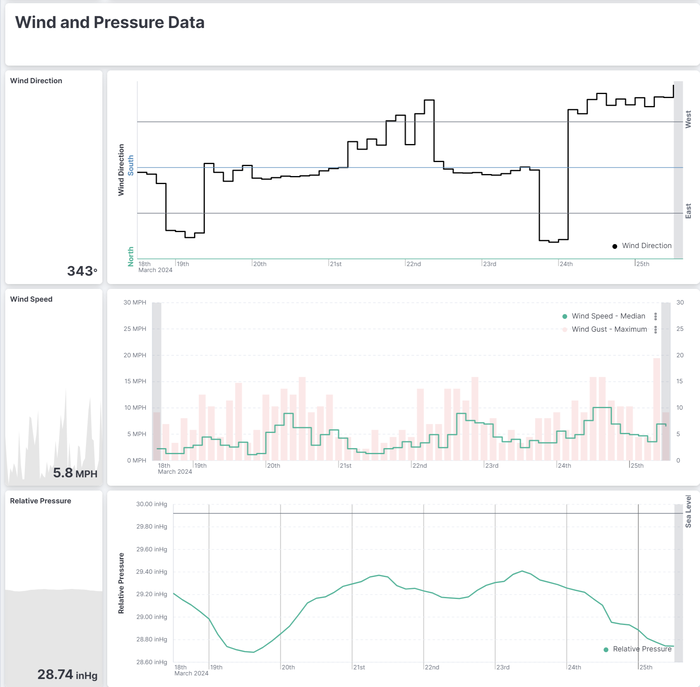

Elasticsearch Component for Home-Assistant

[](https://github.com/hacs/integration)
=====

Publish Home Assistant events to your [Elasticsearch](https://elastic.co) cluster!

Documentation: https://legrego.github.io/homeassistant-elasticsearch/ 

## Table of Contents

- [Getting started](#getting-started)
- [Features](#features)
- [Inspiration](#inspiration)
- [Create your own cluster health sensor](#create-your-own-cluster-health-sensor)
- [Support](#support)
- [Contributing](#contributing)

## Getting started

Visit our documentation site for instructions on [installing](https://legrego.github.io/homeassistant-elasticsearch/install/), [configuring](https://legrego.github.io/homeassistant-elasticsearch/configure/), and [using](https://legrego.github.io/homeassistant-elasticsearch/using_kibana/) this component.

## Features

- Efficiently publishes Home-Assistant events to Elasticsearch using the Bulk API
- Automatically sets up Datastreams using Time Series Data Streams ("TSDS"), Datastream Lifecycle Management ("DLM"), or Index Lifecycle Management ("ILM") depending on your cluster's capabilities
- Supports Elastic's [stack security features](https://www.elastic.co/elastic-stack/security) via optional username, password, and API keys
- Selectively publish events based on domains or entities

## Inspiration

### HVAC Usage
Graph your home's climate and HVAC Usage:



### Weather Station
Visualize and alert on data from your weather station:





### Additional examples

Some usage examples inspired by [real users](https://github.com/legrego/homeassistant-elasticsearch/issues/203):

- Utilizing a Raspberry Pi in [kiosk mode](https://www.raspberrypi.com/tutorials/how-to-use-a-raspberry-pi-in-kiosk-mode/) with a 15" display, the homeassistant-elasticsearch integration enables the creation of rotating fullscreen [Elasticsearch Canvas](https://www.elastic.co/kibana/canvas). Those canvas displays metrics collected from various Home Assistant integrations, offering visually dynamic and informative dashboards for monitoring smart home data.
- To address temperature maintenance issues in refrigerators and freezers, temperature sensors in each appliance report data to Home Assistant, which is then published to Elasticsearch. Kibana's [alerting framework](https://www.elastic.co/kibana/alerting) is employed to set up rules that notify the user if temperatures deviate unfavorably for an extended period. The Elastic rule engine and aggregations simplify the monitoring process for this specific use case.
- Monitoring the humidity and temperature in a snake enclosure/habitat for a user's daughter, the integration facilitates the use of Elastic's Alerting framework. This choice is motivated by the framework's suitability for the monitoring requirements, providing a more intuitive solution compared to Home Assistant automations.
- The integration allows users to maintain a smaller subset of data, focusing on individual stats of interest, for an extended period. This capability contrasts with the limited retention achievable with Home Assistant and databases like MariaDB/MySQL. This extended data retention facilitates very long-term trend analysis, such as for weather data, enabling users to glean insights over an extended timeframe.


## Create your own cluster health sensor
Versions prior to `0.6.0` included a cluster health sensor. This has been removed in favor of a more generic approach. You can create your own cluster health sensor by using Home Assistant's built-in [REST sensor](https://www.home-assistant.io/integrations/sensor.rest).

```yaml
# Example configuration
sensor:
  - platform: rest
    name: "Cluster Health"
    unique_id: "cluster_health" # Replace with your own unique id. See https://www.home-assistant.io/integrations/sensor.rest#unique_id
    resource: "https://example.com/_cluster/health" # Replace with your Elasticsearch URL
    username: hass # Replace with your username
    password: changeme # Replace with your password
    value_template: "{{ value_json.status }}"
    json_attributes: # Optional attributes you may want to include from the /_cluster/health API response
      - "cluster_name"
      - "status"
      - "timed_out"
      - "number_of_nodes"
      - "number_of_data_nodes"
      - "active_primary_shards"
      - "active_shards"
      - "relocating_shards"
      - "initializing_shards"
      - "unassigned_shards"
      - "delayed_unassigned_shards"
      - "number_of_pending_tasks"
      - "number_of_in_flight_fetch"
      - "task_max_waiting_in_queue_millis"
      - "active_shards_percent_as_number"
```

## Support

This project is not endorsed or supported by either Elastic or Home-Assistant - please open a GitHub issue for any questions, bugs, or feature requests.

## Contributing

Contributions are welcome! Please see the [Contributing Guide](CONTRIBUTING.md) for more information.
