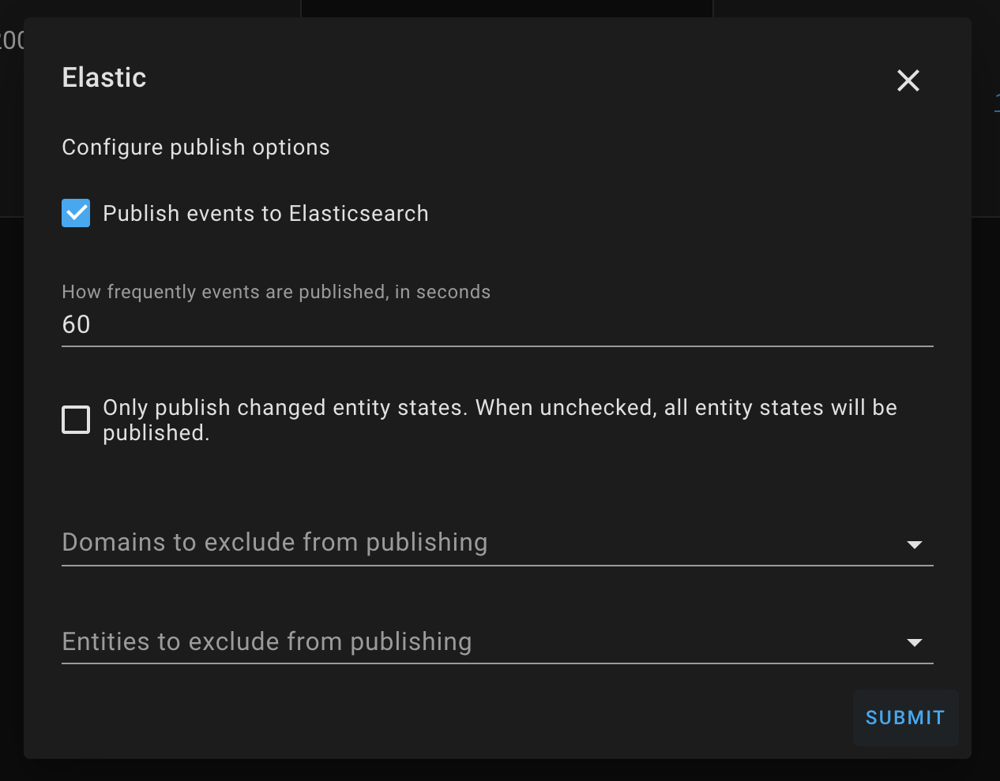

Elasticsearch Component for Home-Assistant

[](https://github.com/hacs/integration)
=====

Publish HASS events to your [Elasticsearch](https://elastic.co) cluster!

## Features

- Efficiently publishes Home-Assistant events to Elasticsearch using the Bulk API
- Automatically maintains Indexes and Index Templates using Index Lifecycle Management ("ILM")
- Supports [X-Pack Security](https://www.elastic.co/products/x-pack/security) via optional username and password
- Tracks the Elasticsearch cluster health in the `sensor.es_cluster_health` sensor
- Exclude specific entities or groups from publishing

## Compatibility

- Elasticsearch 8.0+, 7.11+ (Self or [Cloud](https://www.elastic.co/cloud) hosted). [Version `0.4.0`](https://github.com/legrego/homeassistant-elasticsearch/releases/tag/v0.4.0) includes support for older versions of Elasticsearch.
- [Elastic Common Schema version 1.0.0](https://github.com/elastic/ecs/releases/tag/v1.0.0)
- [Home Assistant Community Store](https://github.com/custom-components/hacs)
- Home Assistant 2022.4+

## Getting Started

The Elasticsearch component requires, well, [Elasticsearch](https://www.elastic.co/products/elasticsearch)!
This component will not host or configure Elasticsearch for you, but there are many ways to run your own cluster.
Elasticsearch is open source and free to use: just bring your own hardware!
Elastic has a [great setup guide](https://www.elastic.co/start) if you need help getting your first cluster up and running.

If you don't want to maintain your own cluster, then give the [Elastic Cloud](https://www.elastic.co/cloud) a try! There is a free trial available to get you started.

## Installation

This component is available via the Home Assistant Community Store (HACS) in their default repository. Visit https://hacs.xyz/ for more information on HACS.

Alternatively, you can manually install this component by copying the contents of `custom_components` to your `$HASS_CONFIG/custom_components` directory, where `$HASS_CONFIG` is the location on your machine where Home-Assistant lives.
Example: `/home/pi/.homeassistant` and `/home/pi/.homeassistant/custom_components`. You may have to create the `custom_components` directory yourself.

## Setup (preferred method)

This component supports interactive configuration via Home Assistant's integration configuration page.
This will be the only supported configuration method in the future.

1. Restart Home-assistant once you've completed the installation instructions above.
2. From the `Integrations` configuration menu, add a new `Elasticsearch` integration. 
3. Provide connection information and optionally credentials to begin setup. 
4. Once the integration is setup, you may tweak all settings via the "Options" button on the integrations page.
   

## Setup (deprecated method)

This component supports yaml-based configuration, but this is deprecated, and will be removed in a future release. Please migrate to the UI-based approach outlined above. Please file an issue if you have any trouble migrating to the new setup process.

1. Copy the contents of `custom_components` to your `$HASS_CONFIG/custom_components` directory, where `$HASS_CONFIG` is the location on your machine where Home-Assistant lives.
   Example: `/home/pi/.homeassistant` and `/home/pi/.homeassistant/custom_components`. You may have to create the `custom_components` directory yourself.
2. Configure the component in `$HASS_CONFIG/configuration.yaml` (see Configuration section below)
3. Restart Home-Assistant

### Expected file structure

```
.homeassistant/
|-- custom_components/
|   |-- elasticsearch/
|       |-- __init__.py
|       |-- const.py
|       |-- es_doc_publisher.py
|       |-- ...etc...
|       |-- index_mapping.json
|       |-- sensor.py

```

## Configuration (deprecated)

This is the bare-minimum configuration you need to get up-and-running:

```yaml
elasticsearch:
  # URL should point to your Elasticsearch cluster
  url: http://localhost:9200
```

### Configuration Variables

All variables are optional unless marked required.

#### Basic Configuration

- **url** (_Required_): The URL of your Elasticsearch cluster
- **username**: If your cluster is protected with Basic Authentication via [X-Pack Security](https://www.elastic.co/products/x-pack/security), then provide a username here
- **password**: If your cluster is protected with Basic Authentication via [X-Pack Security](https://www.elastic.co/products/x-pack/security), then provide a password here
- **timeout** (_default:_ `30`): Elasticsearch connection timeout (in seconds) for all outbound requests.
- **exclude**:
  - **domains**: Specify an optional array of domains to exclude from publishing
  - **entities**: Specify an optional array of entity ids to exclude from publishing
- **tags** (_default:_ [`hass`]): Specify an array of tags to include in each published document.

#### Advanced Configuration

- **verify_ssl** (_default:_ `true`): Set to `false` to disable SSL certificate verification.
- **ssl_ca_path** (_default:_ `None`): Optional path to PEM encoded certificate authority bundle.
- **index_format** (_default:_ `"hass-events"`): The format of all index names used by this component. The format specified will be used to derive the actual index names.
  Actual names use the [Rollover API](https://www.elastic.co/guide/en/elasticsearch/reference/current/indices-rollover-index.html) convention of appending a 5-digit number to the end. e.g.: `hass-events-00001`
- **alias** (_default:_ `"active-hass-index"`): The [index alias](https://www.elastic.co/guide/en/elasticsearch/reference/current/indices-aliases.html) which will always reference the index being written to.
- **publish_frequency** (_default:_ `60`): Specifies how often, in seconds, this component should publish events to Elasticsearch.
- **only_publish_changed** (_default:_ `false`): Specifies that only entities that underwent a state change should be published. When `false`, all entity states are published.
- **ilm_enabled** (_default:_ `true`): Enables [Index Lifecycle Management](https://www.elastic.co/guide/en/elasticsearch/reference/current/index-lifecycle-management.html)
- **ilm_policy_name** (_default:_ `home-assistant`): The ILM policy name.
- **ilm_max_size** (_default:_ `30gb`): Specifies the `max_size` condition of the ILM rollover action.
- **ilm_delete_after** (_default:_ `365d`): Specifies how long to retain documents after rolling over.

### Example Configurations

**Exclude all groups from publishing:**

```yaml
elasticsearch:
  # URL should point to your Elasticsearch cluster
  url: http://localhost:9200
  exclude:
    domains: ["group"]
```

**Exclude a specific switch from publishing:**

```yaml
elasticsearch:
  # URL should point to your Elasticsearch cluster
  url: http://localhost:9200
  exclude:
    entities: ["switch.living_room_switch"]
```

**Multiple exclusions:**

```yaml
elasticsearch:
  # URL should point to your Elasticsearch cluster
  url: http://localhost:9200
  exclude:
    domains: ["group", "automation"]
    entities: ["switch.living_room_switch", "light.hallway_light"]
```

## Security

If you are connecting to a secured Elasticsearch cluster, the user you authenticate with (see `username` and `password` configuration options above)
should have a role assigned with the following privileges. Note that if you adjust the `index_format` or `alias` settings that the role definition must be updated accordingly:

```json
POST /_security/role/hass_writer
{
  "cluster": [
    "manage_index_templates",
    "manage_ilm",
    "monitor"
  ],
  "indices": [
    {
      "names": [
        "hass-events*",
        "active-hass-index-*",
        "all-hass-events"
      ],
      "privileges": [
        "manage",
        "index",
        "create_index",
        "create"
      ]
    }
  ]
}
```
## Support

This project is not endorsed or supported by either Elastic or Home-Assistant - please open a GitHub issue for any questions, bugs, or feature requests.

## Contributing

Contributions are welcome! Please see the [Contributing Guide](CONTRIBUTING.md) for more information.