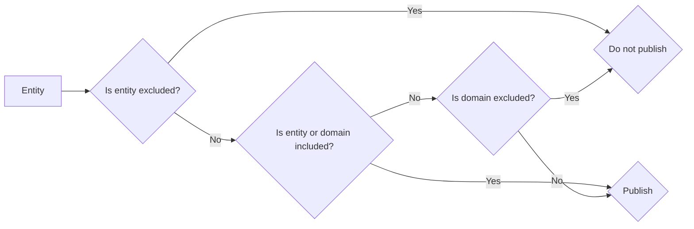

# Configuration

## Gather Elasticsearch details

You will need the following details to configure the Elasticsearch integration:

1. The URL of your Elasticsearch instance
2. Credentials to access the Elasticsearch instance (if required)

### Credentials

You must provide credentials if your Elasticsearch instance is secured. While we support authenticating via username/password, we recommend using API Keys for simplicity and compatibility with all versions of Elasticsearch.

Use the following command to create an API Key for the Home Assistant component.:

=== "curl"
    ```bash
    curl https://localhost:9200/_security/api_key \ # (1)
      -X POST \
      -H "Content-Type: application/json" \
      -u elastic:changeme \ # (2)
      -d'
      {
        "name": "home_assistant_component",
        "role_descriptors": {
          "hass_writer": {
            "cluster": [
              "manage_index_templates",
              "manage_ilm",
              "monitor"
            ],
            "indices": [
              {
                "names": [
                  "metrics-homeassistant.*"
                ],
                "privileges": [
                  "manage",
                  "index",
                  "create_index",
                  "create"
                ]
              }
            ]
          }
        }
      }
    '
    ```

    1. Replace `https://localhost:9200` with the URL of your Elasticsearch instance.
    2. Replace `elastic:changeme` with your Elasticsearch credentials.

=== "Dev Tools"
    ```
    POST /_security/api_key
    {
      "name": "home_assistant_component",
      "role_descriptors": {
        "hass_writer": {
          "cluster": [
            "manage_index_templates",
            "manage_ilm",
            "monitor"
          ],
          "indices": [
            {
              "names": [
                "metrics-homeassistant.*"
              ],
              "privileges": [
                "manage",
                "index",
                "create_index",
                "create"
              ]
            }
          ]
        }
      }
    }
    ```

The API Key will be returned in the response. Save the `encoded` field for use in the configuration.

Read the [Elasticsearch documentation](https://www.elastic.co/guide/en/elasticsearch/reference/current/security-api-create-api-key.html) for more information on creating API Keys.

## Add the integration

This component is configured interactively via Home Assistant's integration configuration page.

1. Verify you have restarted Home Assistant after installing the component.
2. From the [`Integrations` configuration menu](https://my.home-assistant.io/redirect/integrations/), add a new `Elasticsearch` integration.
3. Select the appropriate authentication method
4. Provide connection information and credentials (if using) to begin setup.
5. Once the integration is setup, you may tweak all settings via the `Configure` button on the [integrations page](https://my.home-assistant.io/redirect/integration/?domain=elasticsearch){:target="_blank"}.

## Configuration options

Select `Configure` from the integration's homepage to configure the following settings.

[](https://my.home-assistant.io/redirect/integration/?domain=elasticsearch){:target="_blank"}

### Publish events to Elasticsearch
Indicates if events should be published to Elasticsearch. If disabled, no events will be published to Elasticsearch. The default is `enabled`.

### Publish frequency
The frequency at which events are published to Elasticsearch, in seconds. The default is `60`.

### Publish mode
There are three modes to publish data to Elasticsearch:

- `All` - Publish configured entities to Elasticsearch, including those which did not undergo a state or attribute change.
- `State changes` - Publish configured entities to Elasticsearch only when their state changes.
- `Any changes` - Publish configured entities to Elasticsearch when their state or attributes change.

| Publish Mode | State Change | Attribute Change | No Change |
| ---- | ---- | ---- | ---- |
| All | ✅  Publishes | ✅ Publishes | ✅ Publishes |
| Any Changes | ✅  Publishes | ✅  Publishes | 🚫 Does not publish |
| State Changes | ✅  Publishes | 🚫 Does not publish | 🚫 Does not publish |

### Entity selection
You can choose to include/exclude specific entities and/or entire domains. This allows you to publish only the entities you are interested in to Elasticsearch.
By default, all entities and domains are included.
You can combine inclusion and exclusion filters to fine-tune the entities you want to publish.

The following flowchart describes the logic used to determine if an entity is published:



## Advanced configuration

### Custom certificate authority (CA)

This component will use the system's default certificate authority (CA) bundle to verify the Elasticsearch server's certificate. If you need to use a custom CA, you can provide the path to the CA file in the integration configuration.

1. Place the CA file somewhere within Home Assistant's `configuration` directory.
2. Follow the steps above to [add the integration](#add-the-integration).
3. After providing connection details, the component will attempt to establish a connection to the Elasticsearch server. If the server's certificate is not signed by a known CA, you will be prompted for the CA file's path.
4. Provide the path to the CA file and continue with the setup.

!!! note
    You can choose to bypass certificate verification during setup, if you do not have the CA file available.