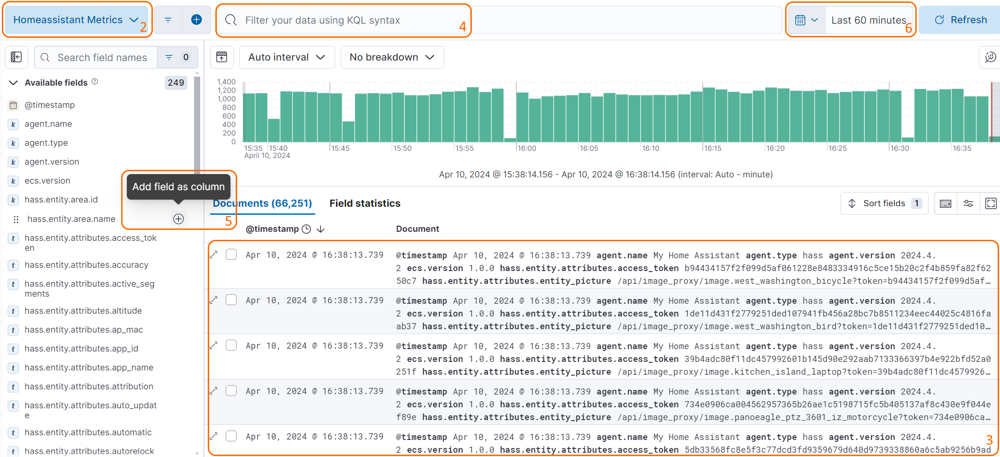
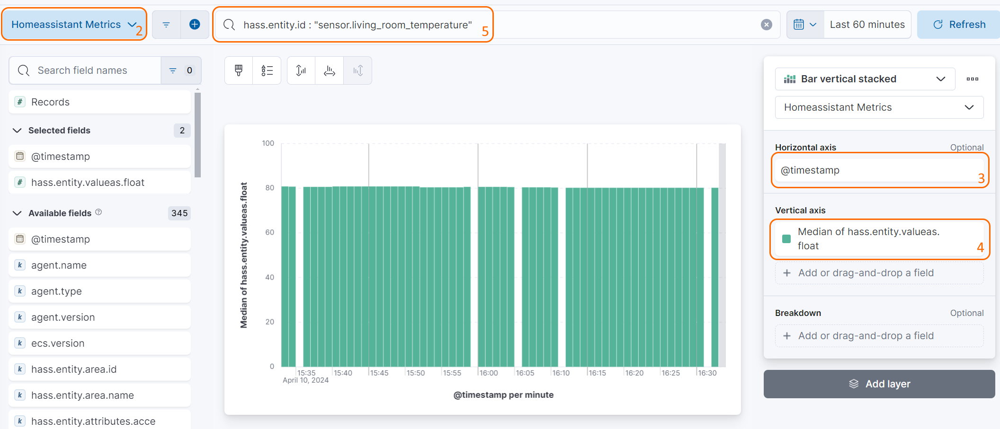

# Using Kibana

The integration will put data into Elasticsearch under the `metrics-homeassistant.*` [data stream](https://www.elastic.co/guide/en/elasticsearch/reference/current/data-streams.html). To explore your data, create visualizations, or dashboards in Kibana you first need to create a [Data View](https://www.elastic.co/guide/en/kibana/current/data-views.html).

## Create a data view

=== "Kibana UI"
    Create a Data View using Kibana's UI:

    1. Open Kibana
    2. Using the instructions in the [Kibana documentation](https://www.elastic.co/guide/en/kibana/current/data-views.html#create-data-view), navigate to the `Data views` page, and create a data view with the following values:
        - **Name**: `Home Assistant Metrics`
        - **Index pattern**: `metrics-homeassistant.*`
        - **Timestamp field**: `@timestamp`

=== "curl"
    Create a Data View using `curl` and Kibana's [Data views API](https://www.elastic.co/guide/en/kibana/current/data-views-api.html):

    ```bash
    KIBANA_URL=http://localhost:5601 # (1)
    KIBANA_USER=elastic # (2)
    KIBANA_PASSWORD=changeme # (3)
    curl -X POST "$KIBANA_URL/api/data_views/data_view" \
        -u "$KIBANA_USER":"KIBANA_PASSWORD" \
        -H "Content-Type: application/json" \
        -H "kbn-xsrf: true" \
        -d'
        {
            "data_view": {
                "title": "metrics-homeassistant.*",
                "name": "Home Assistant Metrics",
                "timeFieldName": "@timestamp"
            }
        }
        '
    ```

    1. Replace `http://localhost:5601` with the URL of your Kibana instance
    2. Replace `elastic` with your Kibana username
    3. Replace `changeme` with your Kibana password

=== "Dev Tools"
    Create a Data View using Kibana's [Dev Tools console](https://www.elastic.co/guide/en/kibana/current/console-kibana.html):

    ```
    POST kbn:/api/data_views/data_view
    {
        "data_view": {
            "title": "metrics-homeassistant.*",
            "name": "Home Assistant Metrics",
            "timeFieldName": "@timestamp"
        }
    }
    ```

## Exploring Home Assistant data in Kibana

Once you have created a Data View, you can start exploring your Home Assistant data in Kibana using `Discover`:

1. In Kibana select `Discover`
2. Select the `Home Assistant Metrics` Data View at the top left
3. You can now see all the Home Assistant data that has been published to Elasticsearch
4. You can filter the data using the filter bar at the top
5. You can pull specific fields into the document table at the bottom by clicking on the `+` icon next to a field
6. You can change the time range of the data you are viewing using the time picker in the top right



## Viewing Home Assistant data in Kibana

When creating new visualizations you may find the following fields useful:

| Field | Description |
| --- | --- |
| `@timestamp` | The timestamp of the event (ex. `Apr 10, 2024 @ 16:23:25.878`) |
| `hass.entity.attributes.friendly_name` | The name of the entity in Home Assistant (ex. `Living Room EcoBee Temperature`) |
| `hass.entity.device.area.name` | The area of the device in Home Assistant (ex. `Living Room`) |
| `hass.entity.id` | The entity id of the entity in Home Assistant (ex. `sensor.living_room_ecobee_temperature`) |
| `hass.entity.value` | The state of the entity in Home Assistant (ex. `72.5`), as a string-typed value |
| `hass.entity.valueas.integer` | The state of the entity in Home Assistant (ex. `72`), as an integer-typed value |
| `hass.entity.valueas.float` | The state of the entity in Home Assistant (ex. `72.5`), as a float-typed value |
| `hass.entity.valueas.boolean` | The state of the entity in Home Assistant (ex. `true`), as a boolean-typed value |
| `hass.entity.valueas.date` | The state of the entity in Home Assistant (ex. `2024-04-10`), as a date-typed value |
| `hass.entity.valueas.datetime` | The state of the entity in Home Assistant (ex. `2024-04-10T16:23:25.878`), as a datetime-typed value |
| `hass.entity.valueas.time` | The state of the entity in Home Assistant (ex. `16:23:25.878`), as a time-typed value |


To build a visualization that shows the temperature of a specific entity over time, you can use the following steps:

1. In Kibana select `Visualizations` and create a new Lens visualization
2. Select `Home Assistant Metrics`
3. For the `Horizontal axis` select `@timestamp`
4. For the `Vertical axis` select `hass.entity.valueas.float`
5. In the filter bar at the top, add a filter for `hass.entity.id` and set the value to the entity id of the entity you want to visualize (ex. `sensor.living_room_ecobee_temperature`) or `hass.entity.attributes.friendly_name` and set the value to the friendly name of the entity you want to visualize (ex. `Living Room EcoBee Temperature`)



## Inspiration

### HVAC Usage
Graph your home's climate and HVAC Usage:


### Weather Station
Visualize and alert on data from your weather station:


### Additional examples

Some usage examples inspired by [real users](https://github.com/legrego/homeassistant-elasticsearch/issues/203):

- Utilizing a Raspberry Pi in [kiosk mode](https://www.raspberrypi.com/tutorials/how-to-use-a-raspberry-pi-in-kiosk-mode/) with a 15" display, the homeassistant-elasticsearch integration enables the creation of rotating fullscreen [Elasticsearch Canvas](https://www.elastic.co/kibana/canvas). Those canvas displays metrics collected from various Home Assistant integrations, offering visually dynamic and informative dashboards for monitoring smart home data.
- To address temperature maintenance issues in refrigerators and freezers, temperature sensors in each appliance report data to Home Assistant, which is then published to Elasticsearch. Kibana's [alerting framework](https://www.elastic.co/kibana/alerting) is employed to set up rules that notify the user if temperatures deviate unfavorably for an extended period. The Elastic rule engine and aggregations simplify the monitoring process for this specific use case.
- Monitoring the humidity and temperature in a snake enclosure/habitat for a user's daughter, the integration facilitates the use of Elastic's Alerting framework. This choice is motivated by the framework's suitability for the monitoring requirements, providing a more intuitive solution compared to Home Assistant automations.
- The integration allows users to maintain a smaller subset of data, focusing on individual stats of interest, for an extended period. This capability contrasts with the limited retention achievable with Home Assistant and databases like MariaDB/MySQL. This extended data retention facilitates very long-term trend analysis, such as for weather data, enabling users to glean insights over an extended timeframe.