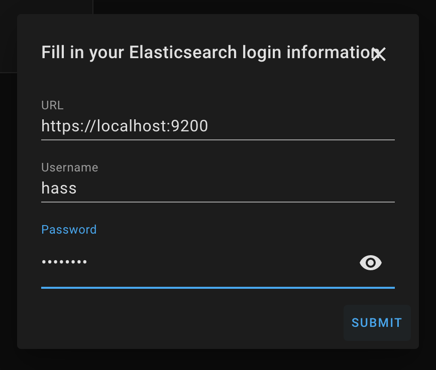

## Features

- Effeciently publishes Home-Assistant events to Elasticsearch using the Bulk API
- Automatically maintains Indexes and Index Templates using Index Lifecycle Management ("ILM")
- Supports [X-Pack Security](https://www.elastic.co/products/x-pack/security) via optional username and password
- Tracks the Elasticsearch cluster health in the `sensor.es_cluster_health` sensor
- Exclude specific entities or groups from publishing

## Compatibility

- Elasticsearch 8.0+, 7.11+ (Self or [Cloud](https://www.elastic.co/cloud) hosted). [Version `0.4.0`](https://github.com/legrego/homeassistant-elasticsearch/releases/tag/v0.4.0) includes support for older versions of Elasticsearch.
- [Elastic Common Schema version 1.0.0](https://github.com/elastic/ecs/releases/tag/v1.0.0)
- [Home Assistant Community Store](https://github.com/custom-components/hacs)
- Home Assistant 2022.4+

## Getting Started

The Elasticsearch component requires, well, [Elasticsearch](https://www.elastic.co/products/elasticsearch)!
This component will not host or configure Elasticsearch for you, but there are many ways to run your own cluster.
Elasticsearch is open source and free to use: just bring your own hardware!
Elastic has a [great setup guide](https://www.elastic.co/start) if you need help getting your first cluster up and running.

If you don't want to maintain your own cluster, then give the [Elastic Cloud](https://www.elastic.co/cloud) a try! There is a free trial available to get you started.

## Setup (preferred method)

This component supports interactive configuration via Home Assistant's integration configuration page.
This will be the only supported configuration method in the future.

1. Restart Home-assistant once you've completed the installation instrictions above.
2. From the `Integrations` configuration menu, add a new `Elasticsearch` integration. 
3. Provide connection information and optionally credentials to begin setup. 
4. Once the integration is setup, you may tweak all settings via the "Options" button on the integrations page.
   

## Setup (deprecated method)

This component supports yaml-based configuration, but this is deprecated, and will be removed in a future release. Please migrate to the UI-based approach outlined above. Please file an issue if you have any trouble migrating to the new setup process.

1. Copy the contents of `custom_components` to your `$HASS_CONFIG/custom_components` directory, where `$HASS_CONFIG` is the location on your machine where Home-Assistant lives.
   Example: `/home/pi/.homeassistant` and `/home/pi/.homeassistant/custom_components`. You may have to create the `custom_components` directory yourself.
2. Configure the component in `$HASS_CONFIG/configuration.yaml` (see Configuration section below)
3. Restart Home-Assistant

### Expected file structure

```
.homeassistant/
|-- custom_components/
|   |-- elasticsearch/
|       |-- __init__.py
|       |-- const.py
|       |-- es_doc_publisher.py
|       |-- ...etc...
|       |-- index_mapping.json
|       |-- sensor.py

```

See https://github.com/legrego/homeassistant-elasticsearch for a complete list of configuration options.
